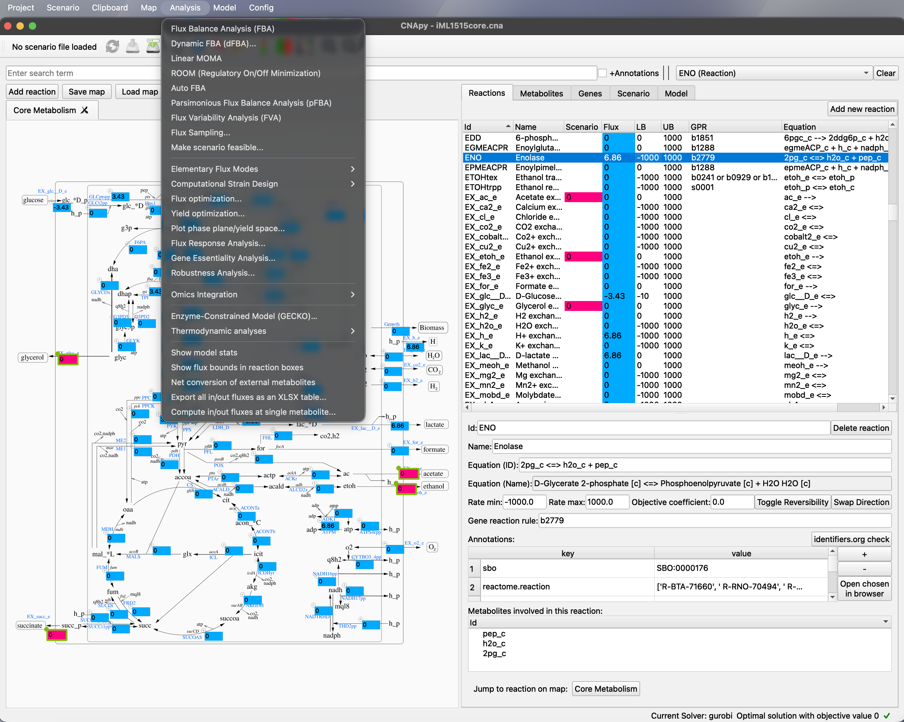

# CNApy (Research Fork): An integrated environment for metabolic modeling

> This repository is a research-oriented fork of [cnapy-org/CNApy](https://github.com/cnapy-org/CNApy), maintained under [jyryu3161/CNApy](https://github.com/jyryu3161/CNApy). It adds features that are not part of upstream CNApy, including GECKO enzyme-constrained modeling, E-Flux2, Dynamic FBA, FSEOF/FVSEOF, and Batch MOMA/ROOM. For the fork-specific change history, see [CHANGELOG.md](CHANGELOG.md).

[](https://github.com/jyryu3161/CNApy/commits/master)
[](https://github.com/jyryu3161/CNApy/issues)



## Introduction

CNApy [[Paper]](https://doi.org/10.1093/bioinformatics/btab828) is a Python-based graphical user interface for a) many common methods of Constraint-Based Reconstruction and Analysis (COBRA) with stoichiometric metabolic models, b) the visualization of COBRA calculation results as *interactive and editable* metabolic maps (including Escher maps [[GitHub]](https://escher.github.io/#/)[[Paper]](<https://doi.org/10.1371/journal.pcbi.1004321>)) and c) the creation and editing of metabolic models, including its reactions, metabolites and genes. For model loading and export, CNApy supports the widely used SBML standard format [[Site]](https://sbml.org/)[[Paper]](https://www.embopress.org/doi/abs/10.15252/msb.20199110). In addition to the upstream features, this fork further supports GECKO 3.0-based enzyme-constrained modeling with integrated proteomics data.

Supported COBRA methods (partly provided by cobrapy [[GitHub]](https://github.com/opencobra/cobrapy)[[Paper]](https://doi.org/10.1186/1752-0509-7-74)) include:

- Flux Balance Analysis (FBA) [[Review]](https://doi.org/10.1038/nbt.1614)
- Flux Variability Analysis (FVA) [[Paper]](https://doi.org/10.1016/j.ymben.2003.09.002)
- Yield optimization (based on linear-fractional programming) [[Paper]](https://doi.org/10.1016/j.ymben.2018.02.001)
- Phase plane analyses (can include flux and/or yield optimizations)
- Flux Sampling of the feasible flux distributions of the model
- Linear MOMA for minimizing the deviation from a reference flux distribution
- ROOM (Regulatory On/Off Minimization) for minimizing significant flux changes after gene knockouts (requires a MILP solver)
- Dynamic FBA (dFBA) for time-course simulation of biomass and extracellular metabolite concentrations via ODE coupling
- Flux Response Analysis that scans a target reaction's flux and plots the maximum production rate of a product reaction
- FSEOF / FVSEOF that automatically identify reactions correlated with a target production flux to suggest over-expression or knockout targets
- Gene Essentiality Analysis for systematic essentiality screening
- Robustness Analysis for evaluating model behavior against parameter variations
- Batch MOMA/ROOM Analysis for running many knockout scenarios in a single batch
- Omics Integration (LAD / E-Flux2) for predicting flux distributions from transcriptome data with multi-condition comparison
- GECKO enzyme-constrained modeling [[GitHub]](https://github.com/SysBioChalmers/GECKO)[[Paper]](https://www.nature.com/articles/s41596-023-00931-7) for extending an existing GEM into an ecModel, integrating proteomics data, and running kcat what-if analyses
- Making measured *in vivo* flux scenarios stoichiometrically feasible, optionally also by altering a biomass reaction [[Paper]](https://academic.oup.com/bioinformatics/article/39/10/btad600/7284109)
- Elementary Flux Modes (EFM) [[Review]](https://analyticalsciencejournals.onlinelibrary.wiley.com/doi/full/10.1002/biot.201200269)
- Thermodynamic methods based on OptMDFpathway [[Paper]](https://doi.org/10.1371/journal.pcbi.1006492)
- Many advanced strain design algorithms such as OptKnock [[Paper]](https://doi.org/10.1002/bit.10803), RobustKnock [[Paper]](https://doi.org/10.1093/bioinformatics/btp704), OptCouple [[Paper]](https://doi.org/10.1016/j.mec.2019.e00087) and advanced Minimal Cut Sets [[Paper]](https://doi.org/10.1371/journal.pcbi.1008110) through its StrainDesign [[GitHub]](https://github.com/klamt-lab/straindesign)[[Paper]](https://doi.org/10.1093/bioinformatics/btac632) integration

**→ For information about how to install and run this fork, see section [Installation and Running](#installation-and-running)**

**→ For more details on CNApy's many features, see section [Documentation and Tutorials](#documentation-and-tutorials)**

**→ If you have questions, suggestions or bug reports regarding this fork, please use the [fork issue tracker](https://github.com/jyryu3161/CNApy/issues). For upstream CNApy itself, you can use the [upstream issues](https://github.com/cnapy-org/CNApy/issues) or [upstream discussions](https://github.com/cnapy-org/CNApy/discussions)**

**→ If you want to cite CNApy, see section [How to cite CNApy](#how-to-cite-cnapy)**

**→ If you want to contribute to this fork, see section [Contributing](#contributing)**

*Associated project note*: If you want to use the well-known MATLAB-based *CellNetAnalyzer* (CNA), *which is not compatible with CNApy*, you can download it from [CNA's website](https://www2.mpi-magdeburg.mpg.de/projects/cna/cna.html).

## Installation and Running

This fork does not provide a PyPI package or a bundled installer — it is intended to be run directly from source. You will need Python 3.10 (no other version), [uv](https://github.com/astral-sh/uv) for environment and dependency management, and OpenJDK for `jpype1`-based Java computations such as EFMtool.

You can install and run this fork as follows:

1. Make sure that uv is installed, e.g. through pip, pipx or another package manager (```apt```, ```brew```, ```nix``` ...):

```sh
# E.g., you can install uv through
pip install uv # or
pipx install uv
```

2. Checkout the latest version of this fork using git

```sh
git clone https://github.com/jyryu3161/CNApy.git
```

3. Change into the source directory and run CNApy

```sh
cd CNApy
uv run cnapy.py
```

uv will automatically install the correct Python version and CNApy dependencies (all done by reading CNApy's pyproject.toml file). If you get a Java/JDK/JVM/jpype error when running CNApy, consider installing OpenJDK [[Site]](https://openjdk.org/install/) on your system to fix this problem.

*Note*: The upstream CNApy PyPI package (```pip install cnapy```) and the bundled installer do not include the additional features provided by this fork (GECKO, E-Flux2, Dynamic FBA, etc.). If you only need upstream features, please refer to the installation instructions in the [upstream repository](https://github.com/cnapy-org/CNApy).

## Documentation and Tutorials

- The [CNApy guide](https://cnapy-org.github.io/CNApy-guide/) contains information for the major upstream functions of CNApy.
- The upstream [CNApy YouTube channel](https://www.youtube.com/channel/UCRIXSdzs5WnBE3_uukuNMlg) provides some videos of working with CNApy.
- The upstream [CNApy example projects](https://github.com/cnapy-org/CNApy-projects/releases/latest) include some of the most common *E. coli* models. These projects can also be downloaded within CNApy at its first start-up or via CNApy's File menu.
- For the GECKO workflow, bundled **Human-GEM** and **Yeast-GEM** datasets can be launched directly via *File > "New project from GECKO example"*.

*Note*: The external resources above cover upstream CNApy. For fork-specific features (GECKO, E-Flux2, Dynamic FBA, etc.), see the [Recent Changes](#recent-changes) section below and [CHANGELOG.md](CHANGELOG.md).

## Contributing

If you would like to contribute to this fork, please refer to [CONTRIBUTING.md](CONTRIBUTING.md). Any contribution intentionally submitted for inclusion in the work by you, shall be licensed under the terms of the Apache 2.0 license without any additional terms or conditions. The development environment is set up the same way as in [Installation and Running](#installation-and-running) — there is no separate developer-only setup.

## How to cite CNApy

If you use CNApy in your scientific work, please cite CNApy's publication:

Thiele et al. (2022). CNApy: a CellNetAnalyzer GUI in Python for analyzing and designing metabolic networks.
*Bioinformatics* 38, 1467-1469, [doi.org/10.1093/bioinformatics/btab828](https://doi.org/10.1093/bioinformatics/btab828).

## Recent Changes

The main feature added in this version is the **GECKO enzyme-constrained modeling** workflow. For the full history including earlier changes, see [CHANGELOG.md](CHANGELOG.md).

### Enzyme-constrained modeling (GECKO)

- GECKO 3.0 ecModel build via *Analysis > "Enzyme-Constrained Model (GECKO)…"*, faithfully implementing the GECKO 3.0 paper methodology with support for both Full and Light formulations.
- Unified workflow dialog with sidebar navigation covering four stages in sequence: Build ecModel (load Kcat / MW data, configure sigma / f / Ptot, choose Full or Light), Enzyme Usage Report (per-enzyme usage and constraint analysis), Proteomics Integration (per-enzyme capacity constraints from measured proteomics), and kcat What-if Analysis (flux impact of modified kcat values).
- GECKO YAML save/load and project-state recovery: GECKO YAML files including EcStructure metadata can be saved and loaded, and ecModel parameters together with build results (protein pool, enzyme constraints, isozyme mappings, etc.) are automatically restored when a ```.cna``` project is reopened. Both plain GEM YAML and ecModel YAML are supported.
- *File → New project from YAML* for starting a new project directly from a GECKO YAML file.
- Bundled **Human-GEM** and **Yeast-GEM** example datasets (DLKcat, customKcats, UniProt included) accessible through *File > "New project from GECKO example"* for running the GECKO workflow immediately.

*Note*: These changes are distributed under the Apache License 2.0 and are part of the original CNApy project.
